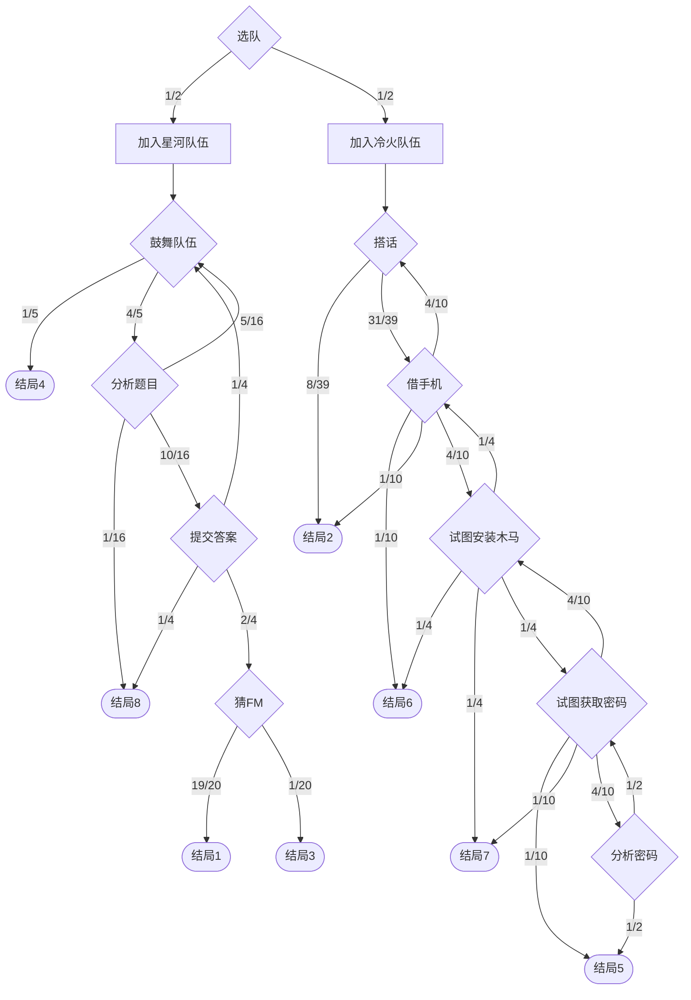
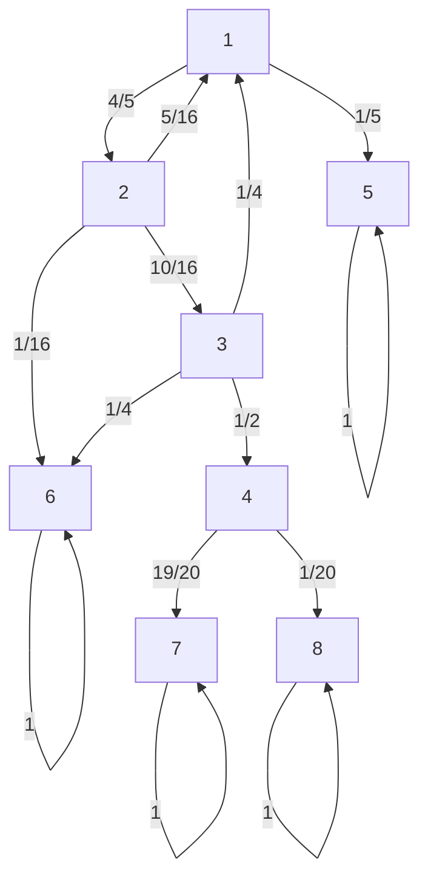

近日沉迷 CTF 与 Puzzlehunt 出题，笔者试图在往届的 Puzzlehunt 比赛中寻找可以引入 CTF 的元素。在 CCBC16 中，指南区的一道题目《你想Roll出怎样的比赛》令笔者印象非常深刻。

题目给出了一大段剧情，需要根据剧情分支用的概率，求出到达每个结局的概率。本文给出了几种使用马尔可夫的转移矩阵的解法，并尝试分析这样精巧的题目是如何被凑出的。

<!-- more -->

# 题目描述

[CCBC 你想Roll出怎样的比赛](https://ccbc16.cipherpuzzles.com/puzzle/2/16)

整个题目流程图如下，需要算出初始从选队出发，到结局 1-8 的概率，进行 A1Z26 转换。



根据条件概率，先考虑左半部分即加入星河队伍，最后将概率乘 $\frac{1}{2}$ 即可。

将其建模为一个马尔可夫链：记 1-8 节点分别为鼓舞队伍、分析题目、提交答案、猜FM、结局4、结局8、结局1、结局3。



得到转移矩阵
$$T=\left(
\begin{array}{cccccccc}
 0 & \frac{4}{5} & 0 & 0 & \frac{1}{5} & 0 & 0 & 0 \\
 \frac{5}{16} & 0 & \frac{10}{16} & 0 & 0 & \frac{1}{16} & 0 & 0 \\
 \frac{1}{4} & 0 & 0 & \frac{1}{2} & 0 & \frac{1}{4} & 0 & 0 \\
 0 & 0 & 0 & 0 & 0 & 0 & \frac{19}{20} & \frac{1}{20} \\
 0 & 0 & 0 & 0 & 1 & 0 & 0 & 0 \\
 0 & 0 & 0 & 0 & 0 & 1 & 0 & 0 \\
 0 & 0 & 0 & 0 & 0 & 0 & 1 & 0 \\
 0 & 0 & 0 & 0 & 0 & 0 & 0 & 1 \\
\end{array}
\right)$$

记
$$T=
\begin{pmatrix}
Q&R\\
0&I
\end{pmatrix}$$
有
$$Q=
\begin{pmatrix}
0&\frac45&0&0\\
\frac5{16}&0&\frac{10}{16}&0\\
\frac14&0&0&\frac12\\
0&0&0&0
\end{pmatrix},
R=
\begin{pmatrix}
\frac15&0&0&0\\
0&\frac1{16}&0&0\\
0&\frac14&0&0\\
0&0&\frac{19}{20}&\frac1{20}
\end{pmatrix}$$

其中 1-4 为暂态，5-8 为吸收态。

记初始状态（从 1 出发）为 $e_1=(1,0,0,0,0,0,0,0)$，需要求出
$$\lim_{n\to\infty}e_1T^n$$

考虑到这是一个吸收马尔可夫链，因此最终状态下 $\lim_{n\to\infty}e_1T^n$ 的前四项应为 $0$。

# 方法一 数值计算

以 Mathematica 为例，取一个足够大的 $n$（$100$ 就够）：

```mathematica
T = {{0, 4/5, 0, 0, 1/5, 0, 0, 0},
  {5/16, 0, 10/16, 0, 0, 1/16, 0, 0},
  {1/4, 0, 0, 1/2, 0, 1/4, 0, 0},
  {0, 0, 0, 0, 0, 0, 19/20, 1/20},
  {0, 0, 0, 0, 1, 0, 0, 0},
  {0, 0, 0, 0, 0, 1, 0, 0},
  {0, 0, 0, 0, 0, 0, 1, 0},
  {0, 0, 0, 0, 0, 0, 0, 1}};
x = {1, 0, 0, 0, 0, 0, 0, 0};
x . MatrixPower[N[T], 100]
```

即得到
$$e_1T^{100}\approx(0.,0.,0.,0.,0.32,0.28,0.38,0.02)$$
最终到节点 5~8 的概率分别为 $0.32, 0.28, 0.38, 0.02$，即在考虑初始选队概率下，到达结局 4, 8, 1, 3 的概率分别为 $0.16, 0.14, 0.19, 0.01$。

# 方法二 级数计算

考虑直接计算 $T^n$。根据分块矩阵乘法，
$$T=
\begin{pmatrix}
Q&R\\
0&I
\end{pmatrix}$$
$$T^2=
\begin{pmatrix}
Q&R\\
0&I
\end{pmatrix}
\begin{pmatrix}
Q&R\\
0&I
\end{pmatrix}=\begin{pmatrix}
Q^2&QR+R\\
0&I
\end{pmatrix}$$

注意右上角的 $QR+R$，其中 $R$ 表示一步之内进入结局，$QR$ 表示先在剧情中走一步，再进入结局。因此右上角表示“两步之内进入结局”的概率。

$$T^3=
\begin{pmatrix}
Q^3&
Q^2R+QR+R\\
0&I
\end{pmatrix}$$

使用数学归纳法不难得到
$$T^n=
\begin{pmatrix}
Q^n&
(I+Q+Q^2+\cdots+Q^{n-1})R\\
0&I
\end{pmatrix}$$

考虑 $Q$ 的意义：$Q$ 描述只在剧情节点之间移动，而暂时没有进入结局，因此 $Q^n$ 描述从某个剧情节点出发，经过 $n$ 步之后，仍然处于剧情节点的概率。这是一个吸收马尔可夫链，从任意地方出发最终都会走到结局之一，最终停留在剧情节点的概率为 $0$。因此 $Q^n\to 0$。

有
$$(I-Q)(I+Q+Q^2+\cdots+Q^{n-1})=I-Q^n$$
$$I+Q+\cdots+Q^{n-1}=(I-Q)^{-1}(I-Q^n)$$
因为 $Q^n\to0$，所以 $I-Q^n\to I$，于是
$$I+Q+\cdots+Q^{n-1}
\to
(I-Q)^{-1}$$
无限矩阵等比级数
$$(I-Q)^{-1}=I+Q+Q^2+Q^3+\cdots$$
因此
$$\lim_{n\to\infty}T^n
=
\begin{pmatrix}
0&(I-Q)^{-1}R\\
0&I
\end{pmatrix}$$

令吸收概率矩阵
$$H=(I-Q)^{-1}R=R+QR+Q^2R+Q^3R+\cdots$$

其中每一项 $Q^nR$ 表示先在剧情节点走 $n$ 步再进入结局。把所有可能经历任意多步剧情后最终进入结局的概率全部加起来即得到 $H$。

```mathematica
Q = T[[1 ;; 4, 1 ;; 4]];
R = T[[1 ;; 4, 5 ;; 8]];
H = Inverse[IdentityMatrix[4] - Q] . R
H[[1]]
```

得到
$$H=\left(
\begin{array}{cccc}
 \frac{8}{25} & \frac{7}{25} & \frac{19}{50} & \frac{1}{50} \\
 \frac{3}{20} & \frac{7}{20} & \frac{19}{40} & \frac{1}{40} \\
 \frac{2}{25} & \frac{8}{25} & \frac{57}{100} & \frac{3}{100} \\
 0 & 0 & \frac{19}{20} & \frac{1}{20} \\
\end{array}
\right)$$
$$H_1=(\frac{8}{25},\frac{7}{25},\frac{19}{50},\frac{1}{50})=(0.32,0.28,0.38,0.02)$$

# 方法三 列方程

先考虑最终走到状态 5 的概率。定义 $p_i=P(\text{从状态 }i\text{ 出发最终进入状态5})$，其中 $i=1,2,3,4$ 为暂态。组成列向量

$$p=[p_1,p_2,p_3,p_4]$$

$$Qp=
\begin{pmatrix}
\frac45p_2\\
\frac5{16}p_1+\frac{10}{16}p_3\\
\frac14p_1+\frac12p_4\\
0
\end{pmatrix}$$

列状态转移方程有

$$p_1=\frac45p_2+\frac15$$
$$p_2=\frac5{16}p_1+\frac{10}{16}p_3$$
$$p_3=\frac14p_1+\frac12p_4$$
$$p_4=0$$

而状态 5 对应的概率进入为 $R$ 的第一列：
$$r_5=[\frac{1}{5},0,0,0]$$

因此可以写成
$$p=Qp+r_5$$
$$(I-Q)p=r_5$$
$$p=(I-Q)^{-1}r_5$$

而由于 $r_5$ 是 $R$ 的第一列，记 $e_1=[1,0,0,0]$，则
$$r_5=Re_1$$
$$p=(I-Q)^{-1}Re_1$$

与方法二相同，定义吸收概率矩阵 $H=(I-Q)^{-1}R$，有 $p=He_1$，从每个暂态出发最终到达状态 5 的概率就是 H 的第一列。

同理，考虑 $r_6,r_7,r_8$，可知
$$H=
\begin{pmatrix}
P(1\to5)&P(1\to6)&P(1\to7)&P(1\to8)\\
P(2\to5)&P(2\to6)&P(2\to7)&P(2\to8)\\
P(3\to5)&P(3\to6)&P(3\to7)&P(3\to8)\\
P(4\to5)&P(4\to6)&P(4\to7)&P(4\to8)
\end{pmatrix}$$

因此，从状态 1 出发到达状态 5,6,7,8 的概率为 $H$ 的第一行。与方法二得到的结论相同。

# 结论

右半部分加入冷火队伍同理计算即可，抵达结局 1-8 分别对应 19%, 23%, 1%, 16%, 3%, 15%, 9%, 14%，A1Z26 可得答案 `SWAP COIN`。

# 反向凑题

出题者是如何凑出每步的转移概率，使题目保证抵达结局 1-8 的概率都是「整数%」的（即 $\frac{k}{100}$）？

在 Puzzlehunt 出题中，很有可能已经事先定好了这题的形式与答案，是通过对话的方式计算概率并做 A1Z26 转换，所以硬性要求答案中的字母序号之和为 $100$。这点满足后即可构造各个转移概率。

有
$$H=(I-Q)^{-1}R$$
$$H_{ij}=P(\text{从暂态 }i\text{ 出发最终进入结局 }j)$$

回顾
$$T=
\begin{pmatrix}
Q&R\\
0&I
\end{pmatrix}$$
各个矩阵的含义为 $Q$：暂态→暂态，$R$：暂态→结局，$0$：结局→暂态，$I$：结局→结局。

根据已知的答案 `SWAP COIN`（即 $H$ 的第一行），解出的
$$R=(I-Q)H=H-QH$$
按行有
$$R_i=H_i-\sum_jQ_{ij}H_j$$

因此，可以先决定每个剧情节点最终应该以什么概率进入各结局，再任意选择剧情节点之间的转移 $Q$，最后直接算出必须设置的直接结局概率 $R$。只要检查 $R\ge 0$ 即可，同时最好每个概率的分母不要太大。

假设有 $m$ 个结局（答案有 $m$ 个字母），先设计一个矩阵
$$H=
\begin{pmatrix}
\text{节点1的最终概率}\\
\text{节点2的最终概率}\\
\vdots\\
\text{节点k的最终概率}
\end{pmatrix}$$
要求每行都是一个概率分布，满足 $H_{i,j}\ge 0$，$\sum_j H_{ij}=1$；为了满足整数百分比，可以选择 $H_1=\left(\frac{a_1}{100},\frac{a_2}{100},\ldots,\frac{a_m}{100}\right)$，其中 $a_i$ 为整数，求和为 $100$ 即可。

然后任意挑选 $Q$。以本题为例，选择 $Q$ 即剧情节点间转移的概率，计算 $R=(I-Q)H$，只要满足 $R_{ij}\ge0$ 即合法。